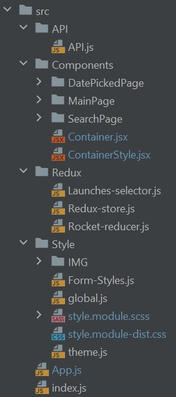
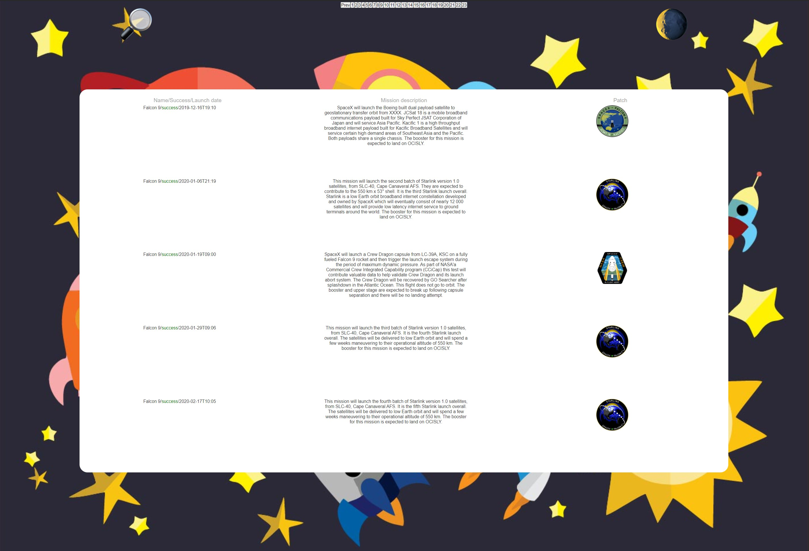
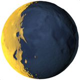
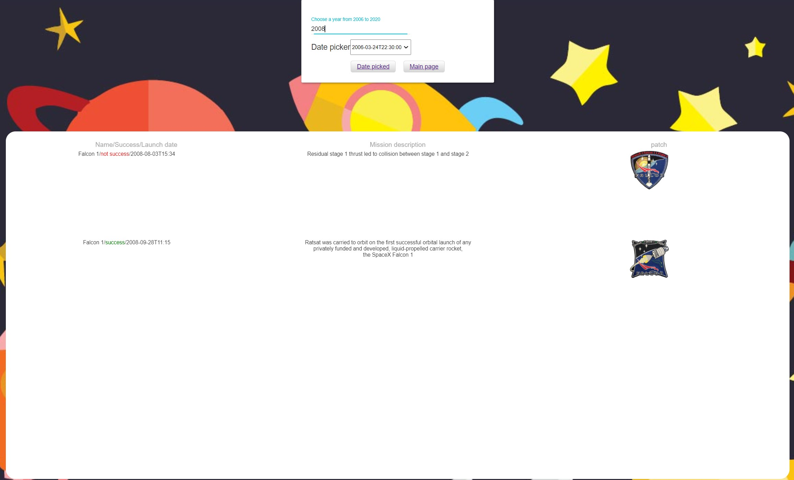
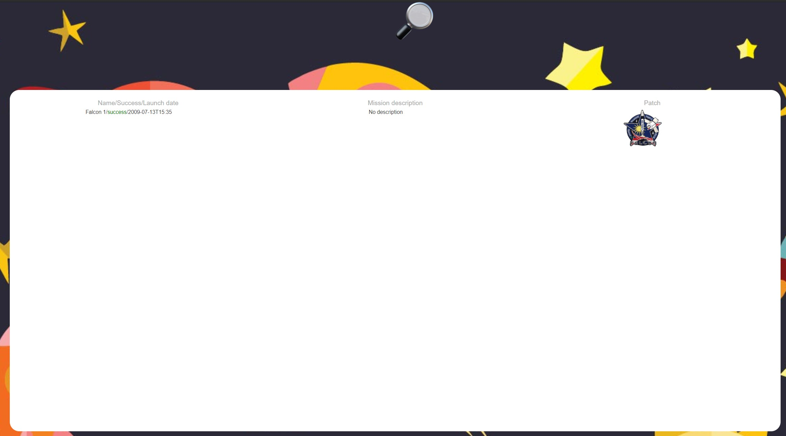

# SpaceX Rest API

### Живая версия - [LiveVersion](https://spacex-saint-fons.vercel.app/)
### ТЗ - [notion.so](https://www.notion.so/front-end-258e55dfd25e40f09d1f342f8e9a7aa5)

## Для запуска:

###  `yarn install`
###  `yarn start`

## Продакшн версия:

### `yarn build`

### Структура папок;

### ./src/API/ (Файл запрос axios запроса к API SpaceX https://api.spacexdata.com/v3/launches)
### ./src/Components/Container (Компонента для предоставления данных из state менеджера)
### ./src/Components/ContainerStyle (Компонента для состояния темной темы)
### ./src/Components/Redux (Файлы state менеджера и файл селектора)
### ./src/Components/Style (Файлы стилей)

### Главная страница содержит элементы;
#### Переход на страницу поиска 
#### Переключатель темы 

### Страница поиска содержит форму ввода года, выбор конкретной даты старта. Кнопку выбора даты и кнопку возврата на главную страницу;

#### После выбора даты и нажатия кнопки Date picked выполняется переход на страницу с информацией о конкретном пуске ракеты

Работы выполнена для [ligaa.agency](https://ligaa.agency/). Без ментора или сторонней помощи. Работоспособность проверена win10/ubuntu20 chrome/firefox(89.0.4389.114/84.0)
